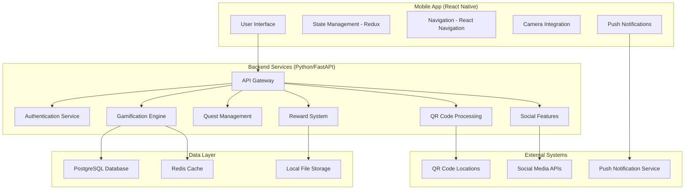

# Design Document

## Overview

RecycleQuest is a cross-platform mobile application built with React Native frontend and Python backend that gamifies recycling through a comprehensive reward system. Users scan QR codes at recycling locations to log activities and earn rewards. The architecture supports real-time social features, quest management, and in-app reward redemption.

## Architecture

### High-Level Architecture



### Technology Stack

**Frontend (Mobile App):**
- React Native 0.72+ for cross-platform development
- Redux Toolkit for state management
- React Navigation 6 for navigation
- React Native Camera for QR scanning
- React Native Push Notifications
- React Native Vector Icons for UI elements
- React Native Chart Kit for progress visualization

**Backend (API Services):**
- Python 3.11+ with FastAPI framework
- SQLAlchemy ORM for database operations
- Pydantic for data validation
- Celery for background task processing
- Redis for caching and session management
- JWT for authentication

**Database & Storage:**
- PostgreSQL for primary data storage
- Redis for caching and real-time features
- Local file storage for images and media (development)
- Supabase Storage for production file storage (1GB free)

**Infrastructure (Development/MVP):**
- Docker containers for local development
- Railway/Render for free backend hosting
- Supabase for PostgreSQL database (500MB free)
- Supabase Storage for file storage (1GB free, no credit card required)
- Upstash Redis for caching (10K commands/day free)
- Supabase CDN for image delivery (included)

**Infrastructure (Production Scale):**
- Railway Pro or Render for backend hosting ($5-20/month)
- Supabase Pro for database scaling ($25/month)
- Supabase Storage Pro for file storage ($0.021/GB)
- Upstash Redis Pro for caching ($0.20 per 100K requests)
- Supabase Edge Functions for serverless scaling (included)

**Real-time Infrastructure (Free Options):**
- WebSocket server using FastAPI WebSocket support (free)
- Redis Pub/Sub for real-time leaderboard updates (free tier available)
- Server-Sent Events (SSE) as WebSocket fallback (free)
- In-memory caching for MVP (free)
- Upgrade to Cloudflare Workers when scaling (paid)

## Components and Interfaces

### Mobile App Components

#### Core UI Components
- **HomeScreen**: Dashboard showing user stats, daily quests, and recent activity
- **QuestScreen**: List of available daily/weekly quests with progress tracking
- **LeaderboardScreen**: Local and global rankings with filtering options
- **ProfileScreen**: User profile, achievements, and level progression
- **MarketplaceScreen**: Reward redemption interface
- **CameraScreen**: QR code scanning for Golden Bin events
- **EducationScreen**: Daily quotes, news, and recycling tips

#### State Management Structure
```typescript
interface AppState {
  user: {
    profile: UserProfile;
    stats: UserStats;
    achievements: Achievement[];
  };
  quests: {
    daily: Quest[];
    weekly: Quest[];
    community: Quest[];
  };
  social: {
    leaderboard: LeaderboardEntry[];
    teams: Team[];
    friends: User[];
  };
  rewards: {
    balance: number;
    marketplace: MarketplaceItem[];
    transactions: Transaction[];
  };
}
```

### Backend API Endpoints

#### Authentication Service
- `POST /auth/register` - User registration
- `POST /auth/login` - User authentication
- `POST /auth/refresh` - Token refresh
- `GET /auth/profile` - Get user profile

#### Gamification Engine
- `GET /user/stats` - Get user statistics and level info
- `POST /user/activity` - Log recycling activity
- `GET /user/achievements` - Get user achievements
- `POST /user/level-up` - Process level progression

#### Quest Management
- `GET /quests/daily` - Get daily quests
- `GET /quests/weekly` - Get weekly quests
- `POST /quests/{quest_id}/complete` - Mark quest as completed
- `GET /quests/progress` - Get quest progress

#### Social Features
- `GET /leaderboard/local` - Get local leaderboard
- `GET /leaderboard/global` - Get global leaderboard
- `WS /leaderboard/live` - WebSocket for real-time leaderboard updates
- `POST /teams/create` - Create team
- `POST /teams/{team_id}/join` - Join team
- `GET /teams/{team_id}/stats` - Get team statistics
- `WS /teams/{team_id}/live` - WebSocket for real-time team progress

#### Real-time Features
- `WS /notifications` - Real-time notifications and achievements
- `POST /events/publish` - Publish real-time events (internal)
- `GET /events/stream` - Server-Sent Events for real-time updates
- `POST /leaderboard/update` - Trigger leaderboard recalculation

#### Reward System
- `GET /marketplace` - Get available rewards
- `POST /marketplace/{item_id}/redeem` - Redeem reward
- `GET /rewards/history` - Get redemption history
- `POST /rewards/golden-bin` - Process Golden Bin scan

#### QR Code Processing
- `POST /qr/scan` - Process QR code scan and award points
- `GET /qr/locations` - Get QR code locations for map display
- `POST /qr/validate` - Validate QR code format and prevent duplicates

## Data Models

### User Model
```python
class User(Base):
    id: UUID
    email: str
    username: str
    password_hash: str
    level: int = 1
    experience_points: int = 0
    recycle_coins: int = 0
    total_recycled_kg: float = 0
    created_at: datetime
    updated_at: datetime
    
    # Relationships
    achievements: List[Achievement]
    quest_progress: List[QuestProgress]
    team_memberships: List[TeamMembership]
```

### Quest Model
```python
class Quest(Base):
    id: UUID
    title: str
    description: str
    quest_type: QuestType  # DAILY, WEEKLY, COMMUNITY
    target_value: int
    reward_xp: int
    reward_coins: int
    start_date: datetime
    end_date: datetime
    is_active: bool = True
    
    # Relationships
    progress_records: List[QuestProgress]
```

### Activity Model
```python
class RecyclingActivity(Base):
    id: UUID
    user_id: UUID
    qr_location_id: UUID
    item_type: str = "general"  # Default since we're not verifying specific items
    weight_kg: float = 1.0  # Default weight for QR scan
    coins_earned: int
    xp_earned: int
    timestamp: datetime
    
    # Relationships
    user: User
    qr_location: QRLocation
```

### Team Model
```python
class Team(Base):
    id: UUID
    name: str
    description: str
    created_by: UUID
    total_recycled_kg: float = 0
    member_count: int = 0
    created_at: datetime
    
    # Relationships
    members: List[TeamMembership]
    creator: User
```

### QR Code Location Model
```python
class QRLocation(Base):
    id: UUID
    location_name: str
    latitude: float
    longitude: float
    qr_code: str  # Unique QR code identifier
    location_type: str  # e.g., "recycling_bin", "golden_bin"
    is_active: bool = True
    points_multiplier: float = 1.0  # For special locations like Golden Bins
    
    # Relationships
    activities: List[RecyclingActivity]
```

## Error Handling

### Mobile App Error Handling
- **Network Errors**: Implement retry logic with exponential backoff
- **Authentication Errors**: Automatic token refresh and re-authentication flow
- **Validation Errors**: User-friendly error messages with input guidance
- **Camera Errors**: Graceful fallback for manual input when camera fails
- **Offline Mode**: Cache critical data and sync when connection restored

### Backend Error Handling
- **Database Errors**: Transaction rollback and error logging
- **Validation Errors**: Detailed error responses with field-specific messages
- **Rate Limiting**: Implement rate limiting with clear error messages
- **QR Code Processing**: Validation and duplicate prevention for QR scans

### Error Response Format
```json
{
  "error": {
    "code": "VALIDATION_ERROR",
    "message": "Invalid input data",
    "details": {
      "field": "email",
      "reason": "Invalid email format"
    },
    "timestamp": "2024-01-15T10:30:00Z"
  }
}
```

## Testing Strategy

### Mobile App Testing
- **Unit Tests**: Jest for component logic and utility functions
- **Integration Tests**: React Native Testing Library for component interactions
- **E2E Tests**: Detox for full user journey testing
- **Performance Tests**: Flipper for performance monitoring
- **Device Testing**: Test on various iOS and Android devices

### Backend Testing
- **Unit Tests**: pytest for individual function testing
- **Integration Tests**: Test API endpoints with test database
- **Load Tests**: Locust for performance and scalability testing
- **Security Tests**: OWASP ZAP for security vulnerability scanning
- **Contract Tests**: Pact for API contract testing

### Test Data Management
- **Mock Data**: Faker library for generating realistic test data
- **Test Fixtures**: Predefined data sets for consistent testing
- **Database Seeding**: Automated test data population
- **Environment Isolation**: Separate test environments for different test types

### Continuous Integration
- **Automated Testing**: Run all tests on every commit
- **Code Coverage**: Maintain >80% code coverage
- **Quality Gates**: Block deployments if tests fail
- **Performance Monitoring**: Track app performance metrics
- **Security Scanning**: Automated security vulnerability detection

### QR Code Integration Testing
- **QR Code Validation**: Test QR code format validation and security
- **Location Verification**: Test QR code location mapping accuracy
- **Duplicate Prevention**: Test prevention of duplicate scans
- **Offline Scenarios**: Test behavior when network is unavailable
- **Edge Cases**: Test invalid QR codes and expired locations
## 
Real-time Multiplayer Architecture

### WebSocket Implementation
For real-time leaderboards and multiplayer features, the system uses:

**WebSocket Server (FastAPI)**
```python
# Real-time connection management
class ConnectionManager:
    def __init__(self):
        self.active_connections: List[WebSocket] = []
        self.user_connections: Dict[str, WebSocket] = {}
    
    async def connect(self, websocket: WebSocket, user_id: str):
        await websocket.accept()
        self.active_connections.append(websocket)
        self.user_connections[user_id] = websocket
    
    async def broadcast_leaderboard_update(self, data: dict):
        for connection in self.active_connections:
            await connection.send_json(data)
```

**Redis Pub/Sub for Scaling**
- Redis channels for different leaderboard types (local, global, team)
- Pub/Sub pattern allows multiple server instances to share real-time updates
- Event-driven architecture for instant leaderboard updates when users recycle

**Free Tier Options**
- **Cloudflare Free Plan**: Basic CDN and DDoS protection (free)
- **Railway/Render**: Free hosting for backend services (with limitations)
- **Upstash Redis**: Free Redis with 10K commands/day
- **Supabase**: Free PostgreSQL with 500MB storage
- **In-memory caching**: Simple Python dictionaries for MVP

**Paid Scaling Options (When Needed)**
- **Cloudflare Workers**: $5/month for 10M requests
- **Cloudflare KV**: $0.50 per million reads
- **Railway Pro**: $5/month when free tiers are exceeded
- **Supabase Pro**: $25/month for 8GB database + more bandwidth

### Leaderboard Update Strategy

**Immediate Updates (Real-time)**
1. User completes recycling activity
2. Backend publishes event to Redis Pub/Sub
3. WebSocket server broadcasts to connected clients
4. Mobile app updates leaderboard instantly

**Batch Updates (Performance)**
1. Aggregate leaderboard changes every 30 seconds
2. Use Redis Sorted Sets for efficient ranking
3. Cache top 100 rankings in Upstash Redis or Cloudflare KV
4. Fallback to Supabase database for full rankings

**MVP Approach (Free)**
- Single server deployment with WebSocket support
- In-memory leaderboard caching with Redis backup
- Simple geographic grouping by user location
- Direct database queries for smaller user base

**Scaling Approach (When Growth Requires)**
- Cloudflare Workers for global distribution ($5/month)
- Regional caching at edge locations
- Smart routing based on user location
- Eventual consistency model for global leaderboards

### Team Battle Real-time Features

**Live Team Progress**
```javascript
// Mobile app WebSocket connection
const teamSocket = new WebSocket('wss://api.recyclequest.com/teams/123/live');
teamSocket.onmessage = (event) => {
  const update = JSON.parse(event.data);
  if (update.type === 'TEAM_PROGRESS') {
    updateTeamProgress(update.data);
  }
};
```

**Event Types**
- `LEADERBOARD_UPDATE`: Position changes in rankings
- `TEAM_PROGRESS`: Real-time team recycling progress
- `ACHIEVEMENT_UNLOCK`: Instant achievement notifications
- `QUEST_COMPLETE`: Quest completion broadcasts
- `GOLDEN_BIN_ALERT`: Mystery drop location announcements

This architecture ensures sub-second updates for competitive features while maintaining scalability through Cloudflare's global network.